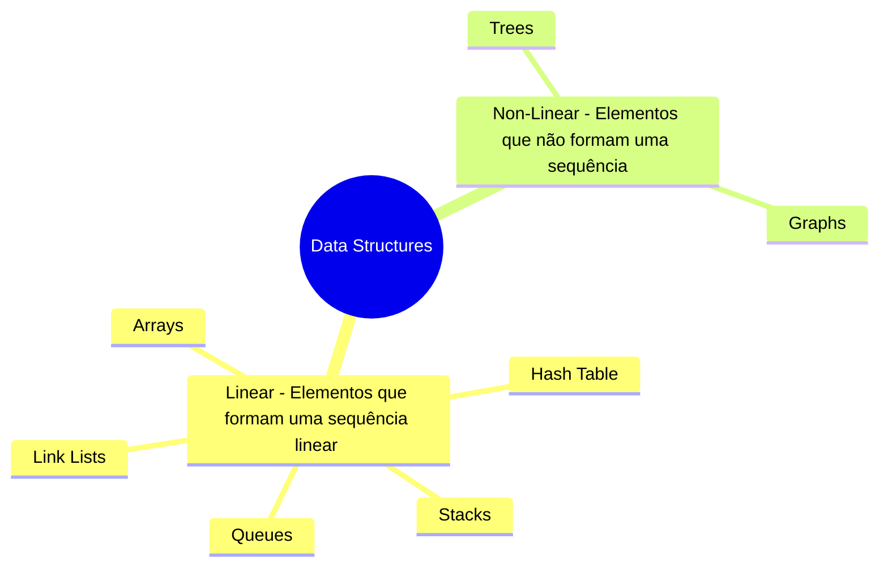

# List of Data Structures

## Visão geral

```mermaid
mindmap
  root((Data Structures))
    Linear - Elementos que formam uma sequência linear 
        Arrays 
        Link Lists
        Stacks
        Queues
        Hash Table
        
    Non-Linear - Elementos que não formam uma sequência
        Trees
        Graphs
```

